# SOFE4630U-MS2
# Milestone 2: Data Processing Service (Dataflow)

##  Repository: 
[https://github.com/GeorgeDaoud3/SOFE4630U-MS2.git](https://github.com/GeorgeDaoud3/SOFE4630U-MS2.git)

## Objective:
1. Get familiar with Dataflow.
2. Understand MapReduce patterns.
3. Run batch and Stream Processing examples over MNIST dataset.

## Dataflow and a Simple Map Reduce Example:
In this section, you will learn about Dataflow, MapReduce pattern, and a word count as a MapReduce example. 
1. Watch this video about [Google Cloud Dataflow](https://www.youtube.com/watch?v=KalJ0VuEM7s).
2. Watch this video about [MapReduce concepts](https://www.youtube.com/watch?v=JZiM-NsdiJo).
3. Read this article about [implementing a word count example using the MapReduce patterns](https://www.analyticsvidhya.com/blog/2022/05/an-introduction-to-mapreduce-with-a-word-count-example/).

## Configure Dataflow
1. Open the GCP site.
2. Search for **Dataflow API**.
    
    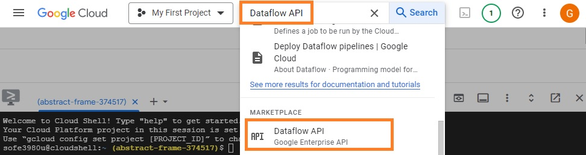
   
3. Then click **Enable** and Wait until the GCP get the service enabled for you.
    
    
   
4. To grant privileges for you project to use Dataflow, search for **Service Accounts**.
    
    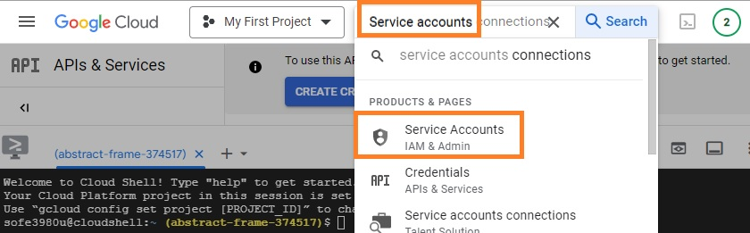

5. Create a new service account.
    
    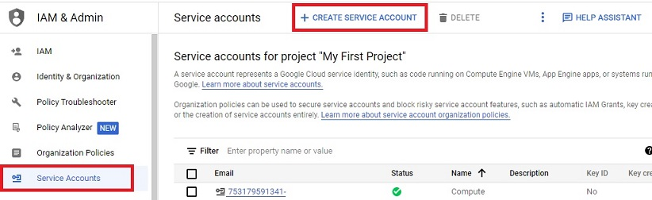

6. As the service name is a global identifier, it’s a good practice to use the project id as a prefix as **ProjectID-DFSA**, the project ID can be copied from the console.
    
    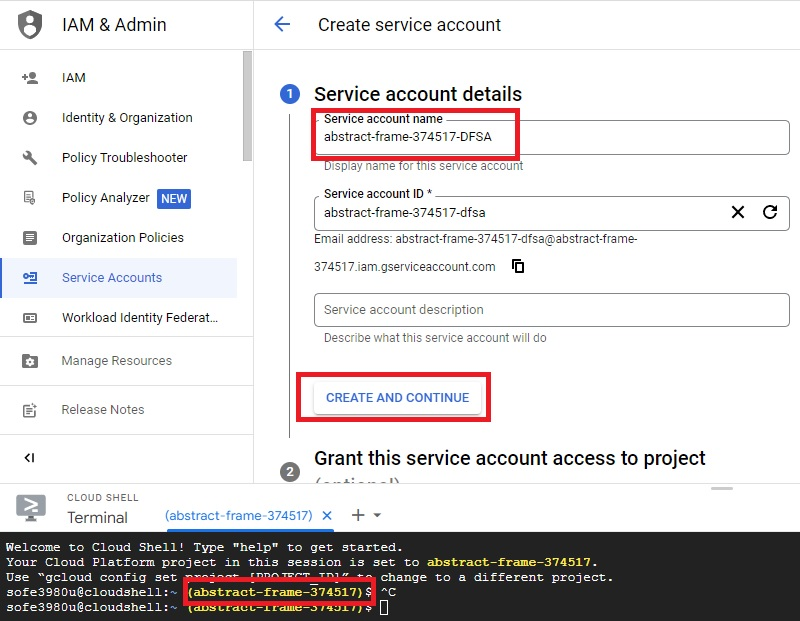

7. Add **Compute Engine Service Agent**  and **Pub/Sub Admin** as roles to the service account.

    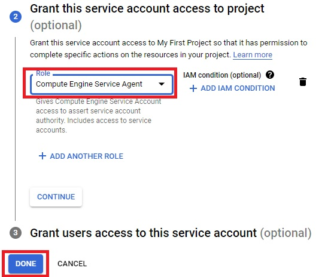

8. Now, it’s time to install the python library of DataFlow
    ``` cmd
    pip install pip --upgrade
    pip install 'apache-beam[gcp]'
    ```

## Running the wordcount Example
1.	A set of examples is already within the Python library folder. The following command will search for the file containing wordcount examples within any subdirectory of the home directory (**~**) and print it.

    ``` cmd
    find ~ -name 'wordcount.py'
    ```

2.	The following command will copy the file to the home directory (Replace path with the **path** you got from the previous step).

    ``` cmd
    cp path  ~/wordcount.py
    ```
    
    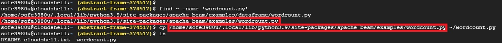

3. Open the file using the text editor. Now, let's try to understand the Python code. The user can send arguments to customize the processing. The first step is to parse those arguments. Lines 69 to 73 define the first argument, which will be set in the calling command using the option **--input**. It's an optional argument; if not given, it will have the default value in line 72. The second argument is set using the **--output** option. It's required (not optional); thus, no default value is needed. After describing the arguments, line 79 will parse the arguments and return a dictionary (**known_args**) with two keys named by the **dest** parameter of the parsed arguments (**input** and **output**)

    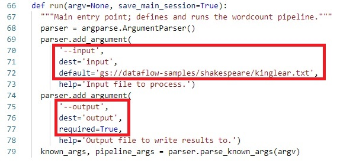
   
4.	The pipeline is described from lines 87 to 106. It's instructions that will be given to a worker to execute. The dataflow will convert each stage into a function and associate a worker node to run it. The number of workers can be scaled by dataflow to satisfy suitable throughput demands.
    * Line 87 defines the root of the processing as a python variable **p**.
    * The first stage inserted after **p** (using **|** operator) is given in line 90. It's called **Read**, which runs a built-in function to read a text file. Note that when executed, the output will be a list of lines (strings). Note also that the pipeline till the first stage is saved into a Python variable named **line**.
    * The statements from lines 92 to 96 add three consequent stages. 
        * The first is called **Split** that splits each line into list of words using a custom class implemented in lines 50:63. 
        * The second is called **PairWithOne** that converts each word into a key/value pair which the key is the word and the value is 1. This stage is used a inline function that takes a word **x** and return the tuple **(x,1)**. 
        * The first two stages are Map operations which takes a single input and produce a single or multiple outputs.
        * The third stage is a Reduce stage that will combine tuples having the same key (word) and then apply the **sum** function over the values to generate a new tuple of a word as a key and the count as the value. 
    * Line 102 append another stage to the pipeline. The stage implements another Map operation that executes a customized function defined in lines 99 and 100 to convert each tuple to a string.
    * A final stage is used to save the output (list of strings) to a text file.

    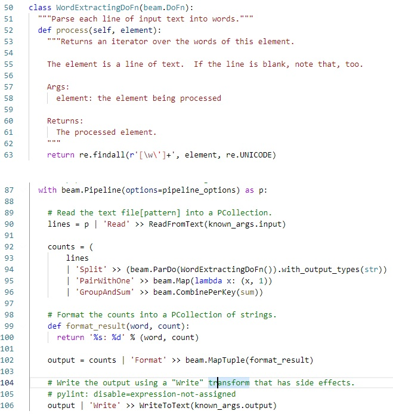

5.	To check the code, we can execute it locally (at the GCP console) first be running the following command. As no input option is given, it will use the default value while the output will be saved in the home directory (current directory) with a prefix **outputs**
    
    ``` cmd
    python wordcount.py --output outputs
    ```
    
    you can display the output file(s) using
    
    ``` cmd
    ls outputs*
    ```
    
    you can open the output file(s) with the text editor or using the Linux command
    
    ``` cmd
    cat outputs* | more
    ```
    
6.	Now, let's run it as a GCP service to benefit from being globally available, managed, and auto scaled by Dataflow. The first step is to get the project ID and save it to an environment variable (**$PROJECT**). (**Note**: the variable is temporally and has to be created if the console or the session is terminated)
    
    ``` cmd
    PROJECT=$(gcloud config list project --format "value(core.project)")
    echo $PROJECT
    ```
    
7.	As the input and output pathes should be globally accessed files, a folder created in Google Cloud Storage is needed to be accessed by the Dataflow service. Google Cloud Storage that acts as a File System is called Bucket. The following steps will lead you to create a Bucket.
    
    a) Search for **Buckets**

    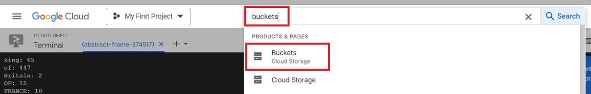
    
    b) Click **create**.

    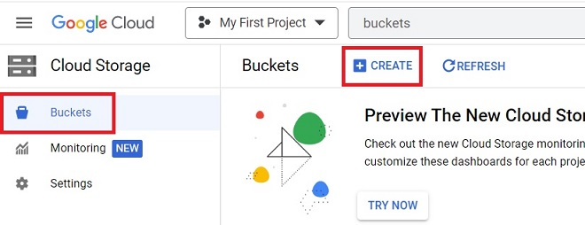
    
    c) As the name of the bucket is a unique global identifier, let’s use the project ID as a prefix as **ProjectID-bucket**. Then click **create**.

    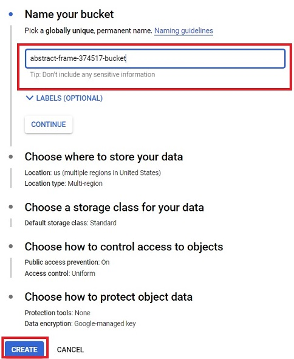
    
    d)	As only the service from our project will access the bucket, enable **public access prevention**.

    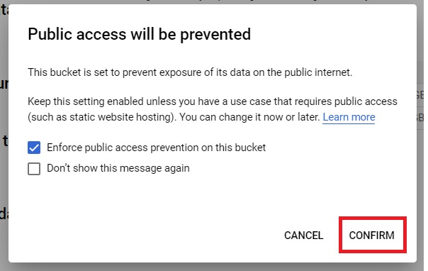
    
    e)	Let’s got the console and create another environment variable for the bucket.
    
    ``` cmd
    BUCKET=gs://$PROJECT-bucket
    echo $BUCKET
    ```

    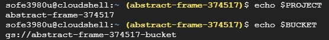
8.	To run the pipeline using DataFlow, run the following command, 
    
    ``` cmd 
    python wordcount.py \
      --region northamerica-northeast2 \
      --runner DataflowRunner \
      --project $PROJECT \
      --temp_location $BUCKET/tmp/ \
      --input gs://dataflow-samples/shakespeare/winterstale.txt \
      --output $BUCKET/result/outputs \
      --experiment use_unsupported_python_version
    ```
    
    Some of the command arguments are needed by Dataflow to process the pipeline while others as input and output are used by the **wordcount** code to generate a customized pipeline. It will take minutes for Dataflow to generate worker nodes, configure them, execute the pipeline, and finally it will display **JOB_STATE_DONE**.

    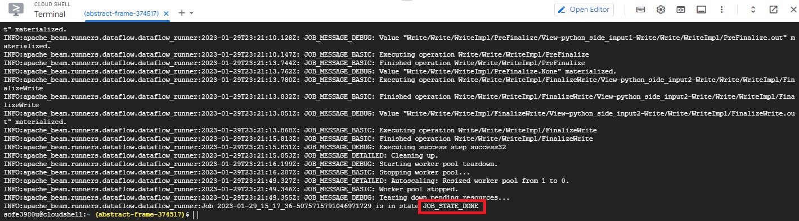
  	
10.	To see the details about Dataflow Job, search for **Dataflow Jobs**, then choose the first one in the list (last job). A diagram of the pipeline will be displayed in which each stage is named as instructed in the python file. Note that, the name is unique and can’t be repeated for different stages. Also, the job info and logs are shown which can be used to debug the job. 
    
    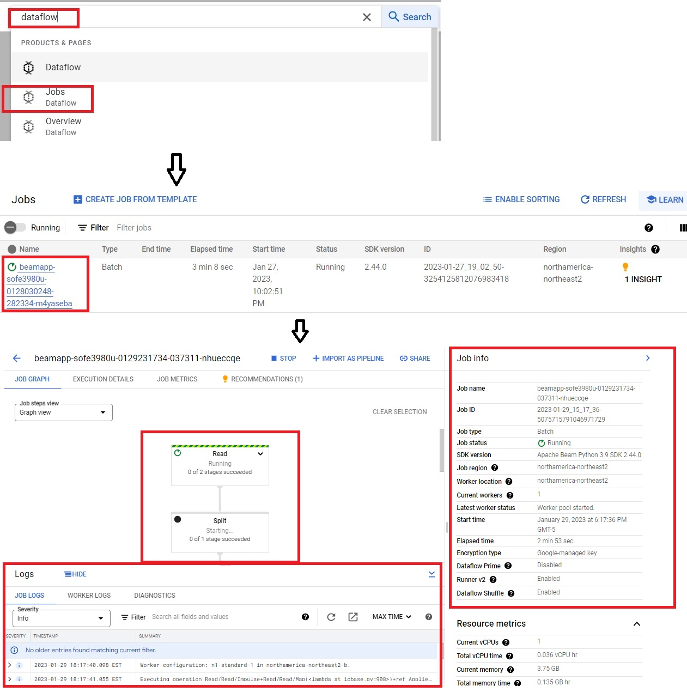

11. Go to the bucket created in step 7 and open the file(s) started by the prefix **outputs** within a folder named **result**. Download the file to read it.
12.	In the GitHub repository, there is also an upgrade to the wordcount script. Make sure that the **PROJECT** and **BUCKET** environment variables are still existing. Then, clone the repository and run the updated script. Try to understand its function.
    ```cmd 
    cd ~
    git clone https://github.com/GeorgeDaoud3/SOFE4630U-MS2.git
    cd ~/SOFE4630U-MS2/wordcount
    python wordcount2.py \
      --region northamerica-northeast2 \
      --runner DataflowRunner \
      --project $PROJECT \
      --temp_location $BUCKET/tmp/ \
      --input gs://dataflow-samples/shakespeare/winterstale.txt \
      --output $BUCKET/result/outputs \
      --output2 $BUCKET/result/outputs2 \
      --experiment use_unsupported_python_version
    ```
## MNIST dataset
The Modified National Institute of Standards and Technology (**MNIST**) dataset consists of handwritten digits that is commonly used for machine learning and image processing applications. Each digit is represented as a 28*28 gray image. The value of pixels ranges from 0 (white) to 255 (black) as shown in the following image. The values are normalized to 1 and converted from a matrix to a vector and stored as string. The string is fed to a Machine Learning (ML) model that estimate the probability that the image represents one of the ten digits. The ML model is implemented using a python library called **TensorFlow**. The detail of the model is behind the scope of this course. What you want to know is that the model parameters and the MNIST CSV are saved in a folder **/MNIST/data** in the repository.

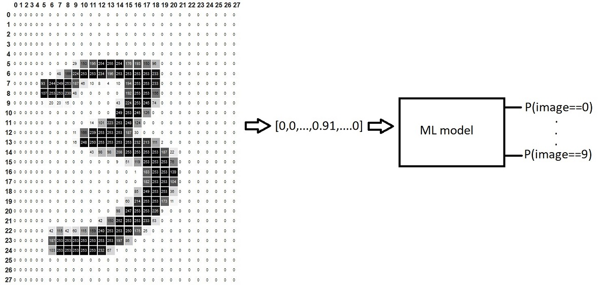

## Data flow Processing the MNIST database from BigQuery
BigQuery is a cloud-based serverless data warehouse that supports SQL. We will use it to store the table containing the MNIST images. Thus, a dataset, namely **MNIST**, will be created within **BigQuerry**. A table, namely **Images**, will be created within the dataset. Then, the CSV file will be uploaded to fill the table. The Dataflow job will query the content of the table, run the ML model on each image, and produce a prediction of the handwritten digit. Finally, The Job will store the results in another table, **Predict**, within the same dataset.

1. Search for **BigQuery**, Within the current project, create a dataset and name it **MNIST**, create a table, name it **Images** and upload the **mnist/data/mnist.csv** file from the repository (you need to download it first to your computer). It may take several minutes to create the dataset and the table.
    
    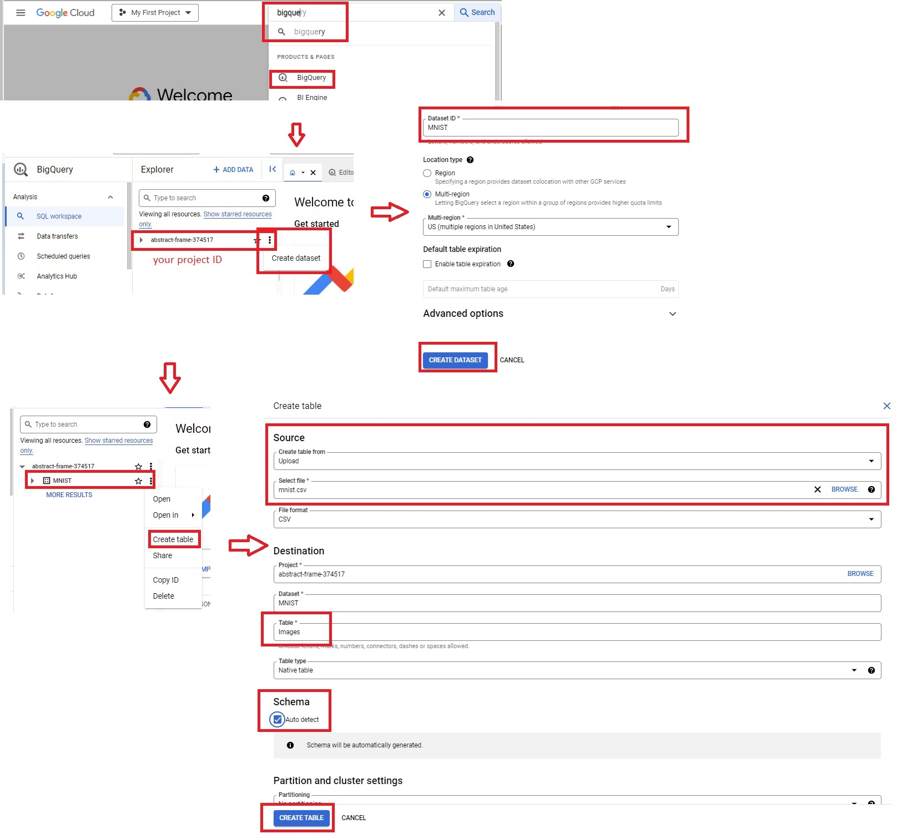
    
2. Go to the bucket created before and upload the model folder from the **/mnist/model** folder from the repository.
3.	Make sure that the Project and Bucket environment variables are already defined then run the DataFlow job using the following commands. 
    ``` cmd
    cd ~/SOFE4630U-MS2/mnist
    python mnistBQ.py \
      --runner DataflowRunner \
      --project $PROJECT \
      --staging_location $BUCKET/staging \
      --temp_location $BUCKET/temp \
      --model $BUCKET/model \
      --setup_file ./setup.py \
      --input $PROJECT.MNIST.Images \
      --output $PROJECT.MNIST.Predict\
      --region  northamerica-northeast2 \
      --experiment use_unsupported_python_version
    ```
    
    Three arguments are used by the python code to create a customized pipeline.
    
    a)	**input** that specify the table name to read the data from which follows the following pattern, **ProjectID.Dataset.Table**
    
    b)	**output** that specifies the table name to be created to store the predicted values.
    
    c)	**model** that specifies the path from which the model parameters can be read.

    Another important argument is **setup_file**. It specifies the libraries needed to be installed on each worker. The following figure shows the list of commands in the **setup_file** that will be executed to initiate each worker. The list contains only one command to install the **TensorFlow** library required to run the model. Note: Installing dependencies will consume time when initiating each worker node. Another approach is to provide a docker image with preinstalled dependencies. This will reduce the launch time of the worker nodes and the job.
    
    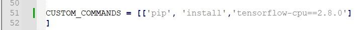
    
4.	As shown in the following image, the pipeline consists of 3 stages:
    
    a.	**ReadFromBQ**: that reads a BigQuery table.
    
    b.	**Prediction**: that call the process function defined within the PredictDoFn class to process each record (row) and returns a dictionary that contains the following fields; **ID**, **P0**,…,**P9** where **ID** is the same as the record ID of the input table, **P0** is the probability that the image represent the digit 0,… . Note that the **@singleton** annotation in line 36, will prevent the model creation to just once which will make the process function run fast. Also, the second argument (**known_args.model**) is in line 86 will be the last argument send to the process function (**checkpoint**).
    
    c.	**WriteToBQ**: that writes the prediction output (**ID**, **P0**,…,**P9**) into another BigQuery table. The table will be created if no exist and will be truncated if exist.
    
    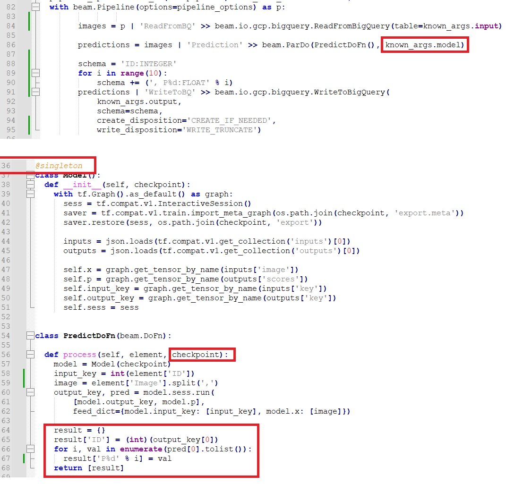
  	
5.	Now, a new table is created in the MNIST dataset, let’s display its content.

    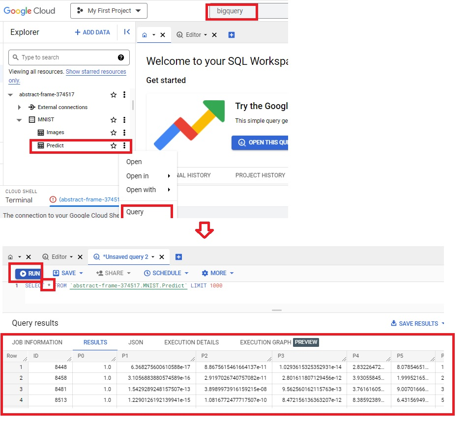

## Data flow Processing the MNIST database from Pub/Sub

In this example, the data will be read and store into Google Pub/Sub. In the previous milestone, you have already learned how to create a topic in Google Pub/sub, a consumer to read the data, and a producer to send data through the pub/sub. This will be the first streaming process. It will keep running until you manually stop it.

1. Go to the **service account** created before and generate a key in JSON format.
2. Create two topics **mnist_image**, and **mnist_predict** at **Google Pub/Sub**.
3. Run the Data flow job that reads JSON objects from the **mnist_image** topic, apply it to the ML model, send the prediction results via **mnist_predict** topic.
    ``` cmd
    cd ~/SOFE4630U-MS2/mnist
    PROJECT=$(gcloud config list project --format "value(core.project)")
    BUCKET=gs://$PROJECT-bucket
    python mnistPubSub.py \
      --runner DataflowRunner \
      --project $PROJECT \
      --staging_location $BUCKET/staging \
      --temp_location $BUCKET/temp \
      --model $BUCKET/model \
      --setup_file ./setup.py \
      --input projects/$PROJECT/topics/mnist_image	\
      --output projects/$PROJECT/topics/mnist_predict \
      --region  northamerica-northeast2 \
      --experiment use_unsupported_python_version \
      --streaming
    ````
    A new arguement **streaming** is used here to mark the pipeline as streaming process. So it will run forever until you manually stop it.

4. The job pipeline consists of five stages:

    a.	**Read from Pub/Sub**: reads messages from the input topic.

    b.	**toDict**: Pub/Sub is agnostic to the type of the message. It’s handled as a stream of bytes. To process the message, The stage deserialize the messagefrom bytes to its original format (JSON).

    c.	**Prediction**: the same as the Prediction in the BigQuery example.

    d.	**To byte**: Serialize the predicted output to bytes.
    
    e.	**To Pub/sub**: send the serialized prediction int the output topic.
    
    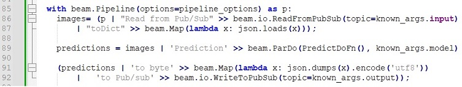
    
5. In your computer, Edit lines 11, 12, and 13 in the file **/mnist/data/producerMnistPubSup.py** to have the path of the JSON, Project ID, and the topic id of mnist_image. The file represent a producer that will send any message consists of a single mnist record each second (**Similar tothe design part in the first milestone**).

6. In your computer, Edit lines 4, 5, and 6 in the file **/mnist/data/consumerMnistPubSup.py** to have the path of the JSON, Project ID, and mnist_predict subscription id. The file represent a consumer that will read any message from the mnist_predict topic and display it (**Similar to the design part in the first milestone**).


    It may take minutes until every things are setup. The whole example can be summarized as:
    a) The producer will produce to the mnist_image topic.  ( your local machine)
    b) Data flow job will read messages, process them, and send them to the mnist_predict topic ( over GCP)
    a) The consumer will consume every result from the mnist_predict topic and display it.  ( your local machine)

7. Note, As the Dataflow job is marked as streaming, it will be still running. To stop it, go to the Dataflow job, and stop it manually.
   
    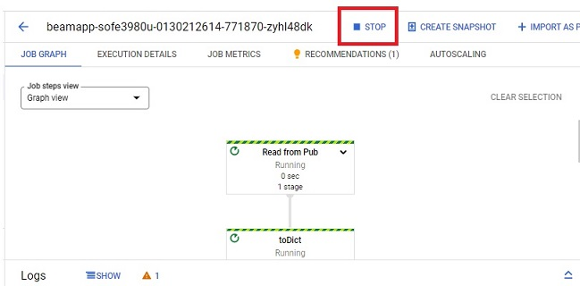

## Design
In the previous milestone, you have sent the smart meter readings to Google Pub/Sub. It's needed to add a Dataflow job to preprocess the smart meter measurements. The job consists of the following stages
1. **Read from PubSub**: read the measurement reading .
2. **Filter**: Eliminate records with missing measurements (containing None). 
3. **Convert**:  convert  the  pressure  from  kPa  to  psi  and  the  temperature  from  Celsius  to  Fahrenheit using the following equations 
    
    𝑃(𝑝𝑠𝑖) = 𝑃(𝑘𝑃𝑎)/6.895
    
    𝑇(𝐹) = 𝑇(𝐶)∗1.8+32
4. **Write to PubSub**: send the measurement back to another topic
 
## Deliverables
1. A report that includes the discription of the second wordcount example (**wordcount2.py**) and the pipeline you used in the Design section. It should have snapshots of the job and results of the four examples (wordcount and mnist) as well as the design part.
2. An audible video of about 4 minutes showing the created job and the results of the four examples (wordcount and mnist).
3. Another audible video of about 3 minutes showing the design part.
